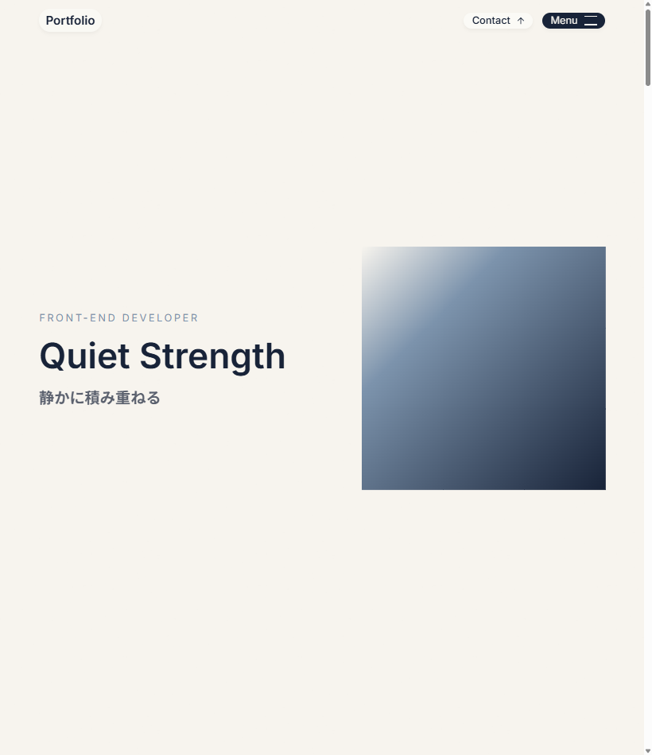

# Quiet Strength — Portfolio

フロントエンドエンジニアを目指す 工藤 千拓 のポートフォリオサイトです。
職業訓練の「AI活用実習」の一環として、AI（Claude Code）と協働して制作しました。

**公開URL：** https://kudo-portfolio.vercel.app/



## コンセプト

「Quiet Strength（静かに積み重ねる）」をテーマに、派手さよりも、少しずつ組み上がっていく動きと落ち着いた配色で構成しています。

## 主な構成

| セクション | 内容 |
| --- | --- |
| Hero | ガラス質のブロックが組み上がり、少しずつ入れ替わり続ける演出 |
| About | これまでの経歴と、学習の経緯 |
| ScrollQuote | スクロールに合わせて、単語が3Dで手前から着地する引用文 |
| Skills | 学んできた技術の一覧 |
| Works | 制作物のカード（自動で流れ、ホバーで減速して停止・ドラッグ／スワイプで操作可能） |
| Philosophy | 制作で大切にしていること |
| Profile | 自己紹介 |
| Contact | お問い合わせフォーム（Formspree） |

## 使用技術

- React 19 / TypeScript
- Vite
- Tailwind CSS v4
- Framer Motion（テキストの表示演出）
- Lenis（なめらかなスクロール）
- Oxlint
- Vercel（公開）
- Claude Code（AIとの協働開発）

## 工夫した点

- **演出の作り込み**
  ヒーローのブロック、引用文の3D表示、マウスに追従する軌跡など、参考サイトの動きを調べたうえで、サイトの雰囲気に合わせて実装しました。
- **スクロールとの連動**
  引用文は、速くスクロールしても一瞬で揃わないよう、スクロール位置に少し遅れて追従させつつ、遅れすぎないよう上限を設けています。
- **パフォーマンス**
  画面外にある演出は再描画を止め、毎フレームの位置の読み取りをなくすことで、スクロール時のカクつきを抑えました。
- **操作性**
  Works のカード列は、マウスを乗せると減速して止まり、ドラッグやスワイプでも動かせます。ドラッグ後にリンクが誤って開かないようにしています。
- **アクセシビリティ**
  OS の「視差効果を減らす」設定がオンの環境では、自動で動く演出を控えるようにしています。

## AIとの協働について

デザインの方向性や文章、演出の細かな調整は自分で判断し、実装と検証（ブラウザでの表示確認・計測）を Claude Code と分担しながら進めました。
「どう見えてほしいか」を言葉で伝え、確認と修正を繰り返すことで、仕上がりを詰めていきました。

## ファイル構成

```
src/
├── App.tsx            … 全体のレイアウト
├── components/        … 各セクションと部品（Hero, Works, ScrollQuote など）
├── hooks/             … useLenis（スクロール）, useMarquee（カード列）, useInView
├── utils/             … セクションへのスクロール
└── index.css          … 配色・文字サイズなどの共通スタイル
public/
└── images/works/      … 制作物のスクリーンショット
```

## ローカルでの実行

```bash
npm install
npm run dev      # http://localhost:5173
npm run build    # 本番用ビルド
```
